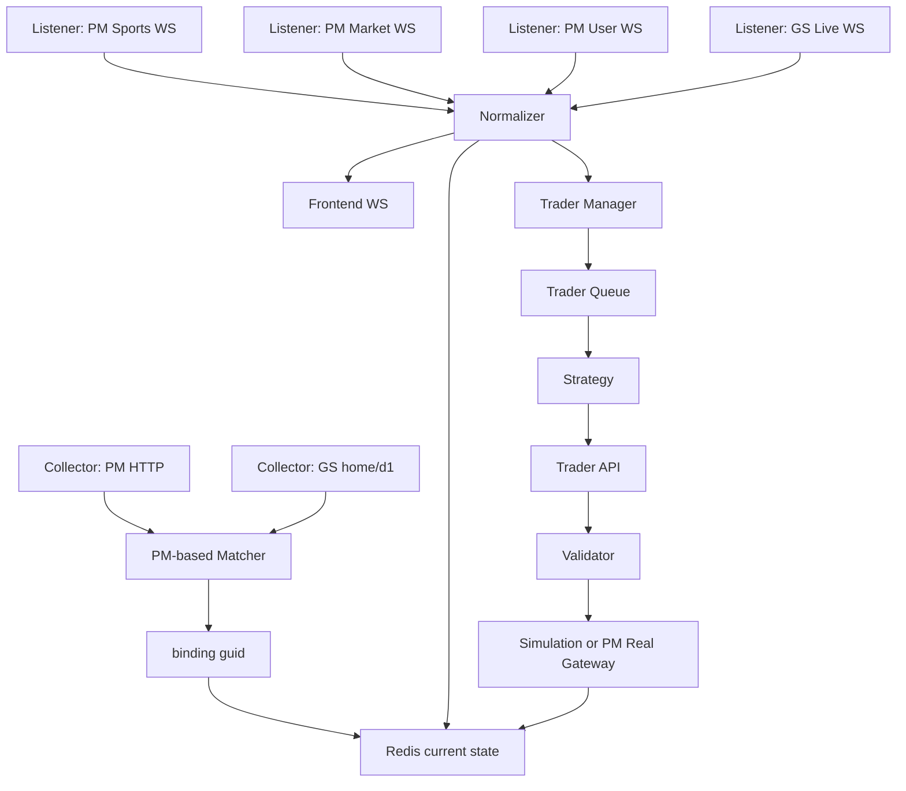

# PDT2.1 系统设计

## 1. 推荐形态

单进程 FastAPI + asyncio 后台任务 + Redis。

第一版不要拆多个服务。一个进程内启动：

- API。
- Collector scheduler。
- Listener supervisor。
- Trader manager。
- Frontend WS broadcaster。
- Redis cleanup task。

后续如果压力上来，再把 Listener 或 Trader 拆进独立进程。第一版先保持简单。

## 2. Agent 角色

### 2.1 Project Manager Agent

职责：

- 控制项目目标和范围。
- 协调 Collector、Listener、Trader。
- 维护开发进度。
- 检查功能完整性。
- 检查 UI 效果一致性。
- 控制代码层级和逻辑简洁性。

Project Manager 不应该亲自扩大技术范围。任何 KS、TRD、篮球、PG、Timescale、多市场框架都应拒绝。

### 2.2 Collector Agent

职责仅限采集模块：

- 调 PM HTTP 接口采集足球比赛。
- 调 GS `home` 和 `d1` 接口采集足球比赛。
- 以 PM 为基准完成 PM/GS 双向匹配。
- 生成全局唯一 `guid`。
- 将匹配后的 PM 比赛及对应关系存为单条绑定记录。
- 设置 TTL 为 5 天。

Collector 不负责：

- 不接 WS。
- 不推送交易员。
- 不执行策略。
- 不下单。

### 2.3 Listener Agent

职责仅限实时监听与分发模块：

- 接入 PM sports WS。
- 接入 PM market WS，实时同步 moneyline ask1/bid1。
- 接入 PM user WS，实时更新用户账户数值并推送前端。
- 接入 GS live WS。
- 过滤只保留系统当前存在的比赛，即可解析到 `guid` 的消息。
- 标准化实时字段。
- 检测变化。
- 入 Redis。
- 推送给 Trader 和前端。

Listener 不负责：

- 不做 HTTP 采集。
- 不做 PM/GS 初始匹配。
- 不做策略判断。
- 不下单。

### 2.4 Trader Agent

职责：

- 开发交易处理通用模块。
- 支持模拟交易和真实交易。
- 提供策略可调用的交易 API。
- 执行通用约束检查。
- 管理交易员实例、账户、持仓、日志、订单。
- 实现默认策略 `football_score_delay_trade`。

Trader 不负责：

- 不接 PM/GS HTTP。
- 不接 PM/GS WS。
- 不修改前端页面结构。

## 3. 推荐目录

```text
backend/
  app/
    main.py
    config.py
    models.py
    store.py
    collector.py
    listener.py
    normalizer.py
    runtime.py
    trader.py
    strategies/
      base.py
      football_score_delay_trade.py
      registry.py
    execution/
      models.py
      validator.py
      simulation.py
      polymarket_gateway.py
    api.py
  tests/
front/
```

这个结构故意少分层。`store.py` 可以先承担 Redis 读写，等代码真的变大再拆。

## 4. 主链路



## 5. guid 与数据隔离

`guid` 是系统内部唯一比赛 ID。

PM 数据和 GS 数据必须分开：

- PM 当前态写 `pm:match:{guid}`。
- GS 当前态写 `gs:match:{guid}`。
- 匹配关系写 `match:{guid}` 或 `binding:{guid}`。

禁止：

- GS 比分覆盖 PM 比分。
- PM 时间覆盖 GS 时间。
- 为了前端展示把两边字段混成一个无法追溯的对象。

API 可以做展示聚合，但 Redis 中 PM/GS 当前态必须保留独立记录。

## 6. Collector 设计

Collector 输入：

- collector settings。
- PM HTTP client。
- GS HTTP client。

Collector 输出：

- `pm:match:{guid}`。
- `gs:match:{guid}`。
- `binding:{guid}`。
- collector run report。

匹配规则：

1. 已有人工绑定。
2. GS inplay/pregame mapping。
3. 队名归一化相似度。
4. 开赛时间窗口。
5. 低置信度 pending。

TTL：

- PM 比赛当前态：5 天。
- GS 比赛当前态：5 天。
- binding：5 天。
- 索引：5 天。

## 7. Listener 设计

Listener 输入：

- PM sports WS payload。
- PM market WS payload。
- PM user WS payload。
- GS live WS payload。

Listener 流程：

```text
receive
  -> parse
  -> resolve guid
  -> filter unknown guid
  -> normalize
  -> detect changes
  -> save source-specific state
  -> publish to trader/frontend
```

标准化字段：

- `received_at_utc`。
- `pushed_at_utc`。
- `source`。
- `guid`。
- `score_home` / `score_away`。
- `match_time`。
- `period`。
- `clock`。
- `red_cards`。
- `yellow_cards`。
- `substitutions`。
- `var_events`。
- `penalties`。
- `free_kicks`。
- `moneyline.home.ask1/bid1`。
- `moneyline.draw.ask1/bid1`。
- `moneyline.away.ask1/bid1`。
- `changed_fields`。
- `raw_ref`。

未知 `guid` 消息进入 `stream:dead_letters`，不推送交易员。

## 8. Trader 设计

每个 Trader 是一个独立运行实例：

- `trader_id`。
- `mode`：simulation / real。
- `strategy_name`。
- `strategy_params`。
- `account_alias`。
- `status`。
- `asyncio.Queue`。

Trader 提供给策略的 API：

- `log_trade()`。
- `log_runtime()`。
- `buy()`。
- `sell()`。
- `get_market(guid)`。
- `get_pm_match(guid)`。
- `get_gs_match(guid)`。
- `get_assets()`。
- `get_positions()`。
- `get_balance()`。

策略只能调用这些 API，不能直接访问 Redis 或 gateway。

## 9. Trader 通用约束

执行 buy/sell 前统一检查：

- 可用额度。
- 资金使用上限。
- 单笔上限。
- 最大持仓数。
- 最多加仓次数。
- 加仓资金上限。
- 自动止损回撤。
- buy 必须有 ask1。
- sell 必须有 bid1 和可卖持仓。
- real mode 必须真实交易开关开启、账户 alias 可用、dry-run 规则满足。

通用参数：

- `max_positions`。
- `max_fund_usage_pct`。
- `max_single_order_pct`。
- `max_add_count`。
- `max_add_fund_pct`。
- `stop_loss_drawdown`，默认 0.05。

## 10. 默认策略

默认策略：`football_score_delay_trade`。

逻辑：

- GS 比分领先 PM 时触发。
- 买入 GS 领先方向对应的 PM moneyline。
- 新信号与持仓方向不一致时立即反手。
- 85 分钟后不建仓，只平仓。
- ask1 > 0.9 不建仓。
- ask1 > 0.95 不加仓。
- 持仓方向 ask1 > 0.95 且其他方向比分变化时立即平仓。

## 11. 前端兼容

复制原前端页面。

要求：

- 页面结构不重做。
- 数据结构和运行逻辑严格参考原页面功能设计。
- 必要时只改 API client / mapper。
- 不为了显示效果补假数据。

保留现有 API 形态：

- `/api/v1/health`
- `/api/v1/strategies/catalog`
- `/api/v1/settings/collector`
- `/api/v1/collector/status`
- `/api/v1/matches`
- `/api/v1/matches/history`
- `/api/v1/ticks`
- `/api/v1/matches/{guid}/snapshots`
- `/api/v1/external-source/match/{guid}`
- `/api/v1/accounts`
- `/api/v1/positions`
- `/api/v1/trades`
- `/api/v1/logs`
- `/api/v1/tradings`
- `/api/v1/ws/market`

