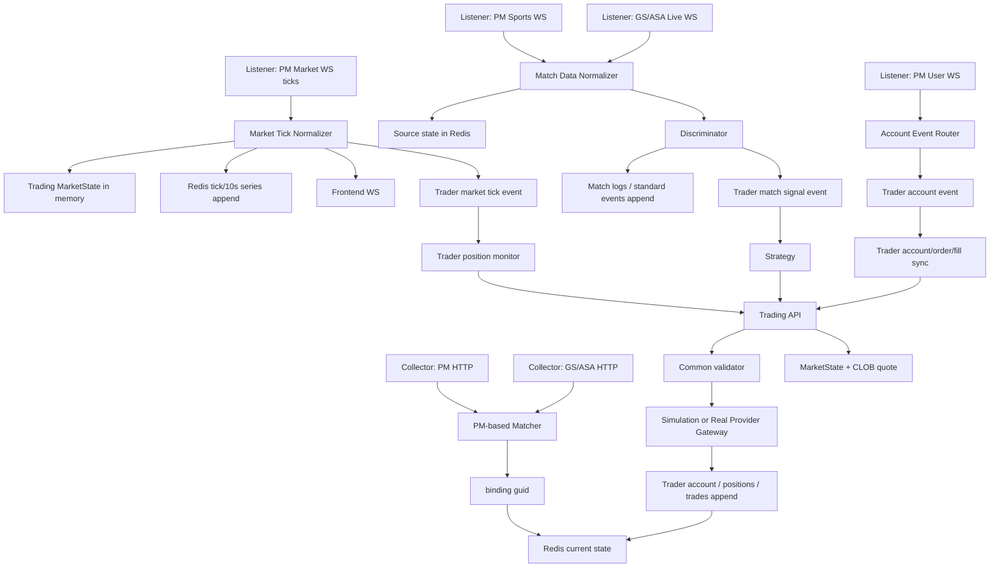

# PDT2.1 系统设计

## 1. 推荐形态

单进程 FastAPI + asyncio 后台任务 + Redis。

第一版不要拆多个服务。一个进程内启动：

- API。
- Collector scheduler。
- Listener supervisor。
- Trader manager。
- Frontend WS broadcaster。
- Redis cleanup task。

后续如果压力上来，再把 Listener 或 Trader 拆进独立进程。第一版先保持简单。

## 2. Agent 角色

### 2.1 Project Manager Agent

职责：

- 控制项目目标和范围。
- 协调 Collector、Listener、Trader。
- 维护开发进度。
- 检查功能完整性。
- 检查 UI 效果一致性。
- 控制代码层级和逻辑简洁性。

Project Manager 不应该亲自扩大技术范围。当前 PDT2.1 不实现 KS、TRD、篮球、PG、Timescale，也不做复杂多市场框架。交易模块可以保留 `provider` 和 gateway 接口，以便后续接入 Polymarket/Kalshi 多账户，但本轮只实现 PM 实盘路径。

### 2.2 Collector Agent

职责仅限采集模块：

- 调 PM HTTP 接口采集足球比赛。
- 调 GS `home` 和 `d1` 接口采集足球比赛。
- 调 ASA HTTP 接口采集或查询近期足球比赛，用于外部数据源匹配。
- 以 PM 为基准完成 PM/GS/ASA 匹配。
- 生成全局唯一 `guid`。
- 将匹配后的 PM 比赛及对应关系存为单条绑定记录。
- 设置比赛相关 TTL 为 3 天。

Collector 不负责：

- 不接 WS。
- 不推送交易员。
- 不执行策略。
- 不下单。

### 2.3 Listener Agent

职责仅限实时监听与分发模块：

- 接入 PM sports WS。
- 接入 PM market WS，实时同步 moneyline ask1/bid1。
- 接入 PM user WS，实时更新用户账户、订单、成交，并推送给前端和对应账号的交易员。
- 接入 GS live WS。
- 接入 ASA live WS，作为 GS 不可用时的外部赛况源。
- 过滤只保留系统当前存在的比赛，即可解析到 `guid` 的消息。
- 标准化实时字段。
- PM market ticks 只做行情入库、最新盘口更新、前端推送、交易模块行情通道推送。
- PM sports、GS、ASA 等比赛数据交给判别器做变化判定。
- PM user 账户、订单、成交事件走账号事件通道，不进入判别器，也不进入策略。
- 入 Redis 时只追加真实收到的数据，不补点、不拟合、不改写历史。

Listener 不负责：

- 不做 HTTP 采集。
- 不做 PM/GS/ASA 初始匹配。
- 不做策略判断。
- 不下单。

### 2.4 Trader Agent

职责：

- 开发交易模块。交易模块包含交易员、策略、交易 API、通用校验、模拟/实盘执行网关和最新行情内存态。
- 支持模拟交易和真实交易。
- 提供实盘交易指令和查询指令。当前实盘 provider 是 Polymarket，后续可扩展 Kalshi。
- 提供策略可调用的交易 API。
- 执行通用约束检查。
- 管理交易员实例、账户、持仓、日志、订单。
- 实现默认策略 `football_score_delay_trade`。
- 接收三类互相隔离的事件：行情 tick、比赛变化信号、账号事件。

Trader 不负责：

- 不接 PM/GS/ASA HTTP。
- 不接 PM/GS/ASA WS。
- 不修改前端页面结构。

## 3. 推荐目录

```text
backend/
  app/
    main.py
    config.py
    models.py
    store.py
    collector.py
    listener.py
    normalizer.py
    runtime.py
    trader.py
    strategies/
      base.py
      football_score_delay_trade.py
      registry.py
    execution/
      models.py
      validator.py
      simulation.py
      polymarket_gateway.py
    api.py
  tests/
front/
```

这个结构故意少分层。`store.py` 可以先承担 Redis 读写，等代码真的变大再拆。

## 4. 主链路



## 5. guid 与数据隔离

`guid` 是系统内部唯一比赛 ID。

PM 数据、GS 数据和 ASA 数据必须分开：

- PM 当前态写 `pm:match:{guid}`。
- GS 当前态写 `gs:match:{guid}`。
- ASA 当前态写 `asa:match:{guid}`。
- 匹配关系写 `match:{guid}` 或 `binding:{guid}`。

禁止：

- GS/ASA 比分覆盖 PM 比分。
- PM 时间覆盖 GS/ASA 时间。
- 为了前端展示把两边字段混成一个无法追溯的对象。

API 可以做展示聚合，但 Redis 中各数据源当前态必须保留独立记录。

## 6. Collector 设计

Collector 输入：

- collector settings。
- PM HTTP client。
- GS HTTP client。
- ASA HTTP client。

Collector 输出：

- `pm:match:{guid}`。
- `gs:match:{guid}`。
- `asa:match:{guid}`。
- `binding:{guid}`。
- collector run report。

匹配规则：

1. 已有人工绑定。
2. GS/ASA 已有外部 ID mapping。
3. 开赛时间窗口。
4. 队名归一化相似度。
5. 低置信度 pending 或人工绑定。

匹配时不依赖联赛名称。短时间内同两队重复相遇概率很低，所以优先用开赛时间前后窗口和主客队队名相似度判断。

TTL：

- PM 比赛当前态：3 天。
- GS 比赛当前态：3 天。
- ASA 比赛当前态：3 天。
- binding：3 天。
- 索引：3 天。

## 7. Listener 设计

Listener 输入：

- PM sports WS payload。
- PM market WS payload。
- PM user WS payload。
- GS live WS payload。
- ASA live WS payload。

PM market tick 流程：

```text
receive
  -> parse
  -> resolve guid
  -> filter unknown guid
  -> normalize
  -> update PM current match/orderbook
  -> update Trading MarketState in memory
  -> append raw tick series
  -> publish frontend market tick
  -> publish Trader market tick event
```

PM sports / GS / ASA 比赛数据流程：

```text
receive
  -> parse
  -> resolve guid
  -> filter unknown guid
  -> normalize source-specific state
  -> save source-specific current state
  -> publish frontend source state
  -> send to Discriminator
```

PM user 账号事件流程：

```text
receive
  -> parse
  -> resolve provider + account_alias
  -> normalize account/order/fill event
  -> save account/order/fill current or append record
  -> publish frontend account event
  -> publish Trader account event for matching account_alias
```

Listener 只做标准化、格式化和分发。它不判断“是否进球、是否点球、是否应该买入”。ticks 数据和账号事件都不走判别器。

标准化字段：

- `received_at_utc`。
- `pushed_at_utc`。
- `source`。
- `guid`。
- `score_home` / `score_away`。
- `match_time`。
- `period`。
- `clock`。
- `red_cards`。
- `yellow_cards`。
- `substitutions`。
- `var_events`。
- `penalties`。
- `free_kicks`。
- `moneyline.home.ask1/bid1`。
- `moneyline.draw.ask1/bid1`。
- `moneyline.away.ask1/bid1`。
- `changed_fields`。
- `raw_ref`。

未知 `guid` 消息进入 `stream:dead_letters`，不推送交易员。

## 8. 判别器设计

判别器只处理比赛数据，不处理 PM market ticks。

输入：

- PM sports 标准化状态。
- GS live 标准化状态。
- ASA live 标准化状态。

职责：

- 在内存中记录每个 source + guid 的最近一次可观察比赛值。
- 对比分、红黄牌、点球、角球、射正等字段做简单变化判定。
- 只对需要日志的变化写比赛日志，例如比分变化、点球、PM 比赛开始和结束。
- 生成标准比赛事件，追加到标准事件流。
- 将比赛变化信号推给交易模块的 match signal 通道。

判别器不负责：

- 不处理盘口 tick。
- 不查交易账户。
- 不执行策略。
- 不改写历史日志。
- 不根据历史行情推断比分。

## 9. Trader 设计

交易模块包含四个概念：

1. 交易模块：事件入口和通用函数集合，维护最新行情内存态，负责买入、卖出、查询、校验和执行。
2. 交易员：账户、持仓、交易记录和统计数据的运行实例。
3. 策略：只根据事件和查询结果生成交易指令，不直接下单。
4. 通用函数：查询行情、查询比赛、查询账户、买入、卖出、写日志、执行风控校验。
5. Provider gateway：实盘交易和查询适配层。当前实现 Polymarket；后续 Kalshi 走同一类接口，不影响策略代码。

每个 Trader 是一个独立运行实例：

- `trader_id`。
- `mode`：simulation / real。
- `provider`：pm / ks，当前只实现 pm。
- `strategy_name`。
- `strategy_params`。
- `account_alias`。
- `status`。
- market tick 订阅状态。
- match signal 订阅状态。
- account event 订阅状态。

交易模块事件入口：

- `on_market_tick(event)`：只处理 PM market tick。用于更新最新行情、驱动交易员监视持仓回撤和强制平仓，不触发比分策略买入。
- `on_match_signal(event)`：只处理判别器输出的比赛变化信号。用于触发策略判断买入、加仓、平仓或记录不交易理由。
- `on_account_event(event)`：只处理实盘账号、订单、成交回报。按 `provider + account_alias` 路由到对应交易员，更新账户/持仓/订单状态，不触发策略买入。

三类事件必须隔离：

- PM market tick 不进入比赛判别器。
- 比分、点球、红黄牌等比赛信号不与 tick 共用去重队列。
- PM user 账号事件不进入判别器，也不进入策略。
- 不允许按 `guid` 丢弃比赛变化信号。
- ticks 可以高频进入行情通道，但不能阻塞或覆盖比赛变化信号、账号事件。

Trader 提供给策略的 API：

- `log_trade()`。
- `log_runtime()`。
- `buy()`。
- `sell()`。
- `get_market(guid)`。
- `get_pm_match(guid)`。
- `get_gs_match(guid)`。
- `get_external_match(guid)`。
- `get_assets()`。
- `get_positions()`。
- `get_balance()`。

交易模块提供给交易员的实盘 API：

- `provider_buy(provider, account_alias, order)`。
- `provider_sell(provider, account_alias, order)`。
- `provider_get_account(provider, account_alias)`。
- `provider_get_positions(provider, account_alias)`。
- `provider_get_orders(provider, account_alias)`。

模拟交易员不调用 provider gateway，自行维护账户、持仓、交易记录。实盘交易员调用 provider gateway，账户、持仓、订单、成交以 provider 返回和 user WS 回报为准，本地 Redis 只做必要缓存和审计。

`get_market(guid)` 规则：

1. 先读取交易模块维护的最新行情内存态。
2. 再查一次 PM CLOB 最新报价。
3. 买入时使用更保守的 ask1，即 `max(memory.ask1, clob.ask1)`。
4. 卖出时使用更保守的 bid1，即 `min(memory.bid1, clob.bid1)`。
5. 如果两者差异大于 0.01，写交易员提示日志；等于 0.01 不算超过。

策略只能调用交易模块 API，不能直接访问 Redis、provider gateway 或账户密钥。

## 10. Trader 通用约束

执行 buy/sell 前统一检查：

- 可用额度。
- 资金使用上限。
- 单笔上限。
- 最大持仓数。
- 最多加仓次数。
- 加仓资金上限。
- 自动止损回撤。
- buy 必须有 ask1。
- sell 必须有 bid1 和可卖持仓。
- real mode 必须真实交易开关开启、provider + account alias 可用、dry-run 规则满足。

通用参数：

- `max_positions`。
- `max_fund_usage_pct`。
- `max_single_order_pct`。
- `max_add_count`。
- `max_add_fund_pct`。
- `stop_loss_drawdown`，默认 0.05。

回撤规则由交易员强制执行，不是策略规则：

- 交易员订阅 market tick。
- 对每个持仓方向维护买入后最高 ask1。
- 当当前 ask1 从最高 ask1 回落 `stop_loss_drawdown` 的绝对价格时，强制按 bid1 平仓。
- 例如买入 ask1 为 0.40，最高涨到 0.65，回落到 0.60 时触发。

## 11. 默认策略

默认策略：`football_score_delay_trade`。

逻辑：

- GS 或 ASA 等外部数据源比分变化早于 PM base 比分变化时触发。
- 外部比分领先 PM 时，买入领先方向对应的 PM moneyline。
- 外部比分追平且 PM 仍未追平时，买入 Draw。
- 新信号与持仓方向不一致时立即反手。
- 买入信号方向 ask1 > 0.93 时，不建仓、不加仓。
- 85 分钟后建仓或加仓金额减半。
- 领先方净胜球从 2 变为 1，且当前 bid1 > 0.85 且收益为正时，全部平仓。

策略不做：

- 不监听 PM market tick 做回撤。
- 不直接读 Redis。
- 不直接下单。
- 不改写交易员账户或持仓。

## 12. 前端兼容

复制原前端页面。

要求：

- 页面结构不重做。
- 数据结构和运行逻辑严格参考原页面功能设计。
- 必要时只改 API client / mapper。
- 不为了显示效果补假数据。

保留现有 API 形态：

- `/api/v1/health`
- `/api/v1/strategies/catalog`
- `/api/v1/settings/collector`
- `/api/v1/collector/status`
- `/api/v1/matches`
- `/api/v1/matches/history`
- `/api/v1/ticks`
- `/api/v1/matches/{guid}/snapshots`
- `/api/v1/external-source/match/{guid}`
- `/api/v1/accounts`
- `/api/v1/positions`
- `/api/v1/trades`
- `/api/v1/logs`
- `/api/v1/tradings`
- `/api/v1/ws/market`
